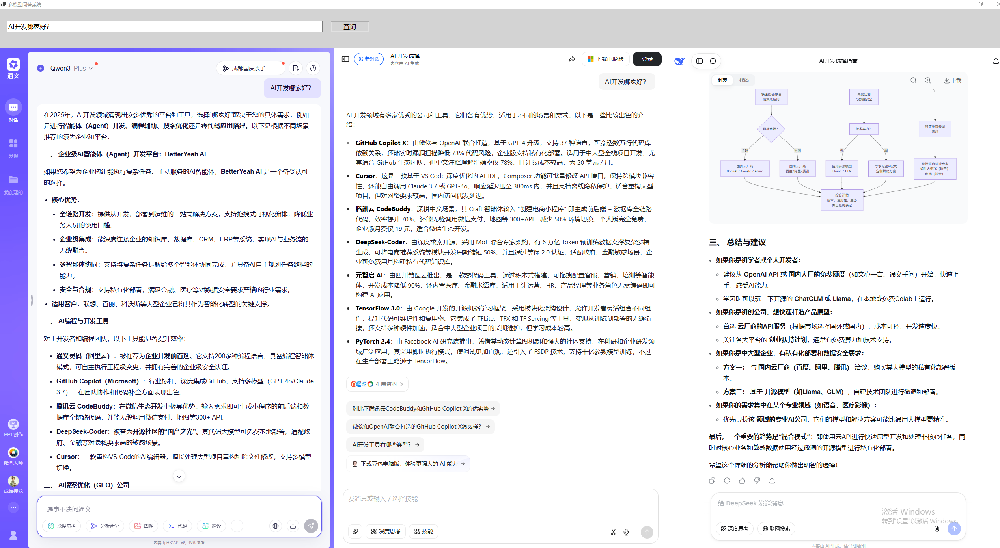
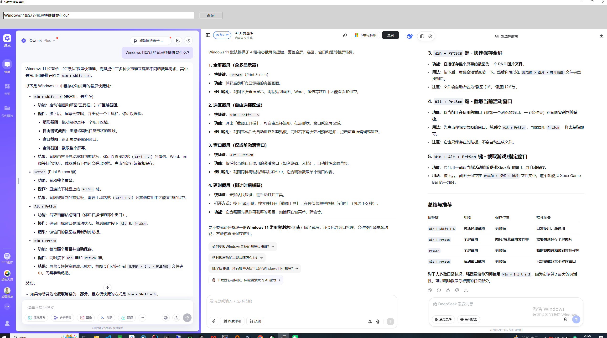

# 在同一个窗口打开多家大模型问答系统

这是一个基于C#和CefSharp（Chromium 109）实现的在同一个窗口打开多家大模型系统，可以在窗口中输入一句话，同时向通义千问、豆包和DeepSeek发送相同的问题，并查看各模型的回答。
使用前各个网页需要用户自行先进行登录，登录后，同一个输入可以被各模型接收并返回结果。

觉得有用或者好玩的话，请给个star，感谢！

## 最终效果

## 说明
  我在使用大模型查询资料的时候，经常会遇到需要将同一个问题在多家大模型中进行问答，并找出他们回答的不同之处和相同之处，以判断是否有幻觉，或者输出错误的内容。

  现实中我需要反复复制一个问题，到各个浏览器里进行操作，觉得有点麻烦，所以就写了这么一个玩意儿。

  这个在我的显示屏2560x1440分辨上 ，可以完整地看到不同的大模型厂家输出内容。

  本软件代码，全部由AI生成，我只写了提示词，工具是Qorder,不管是开发还是打包，都由工具完成。

  Qorder版本: 0.2.5

   VSCode Version: 1.100.0 (user setup)

   提交: 16cd366960161a956c5ec5d028a1a295e2b0529c

   日期: 2025-10-10T12:08:54.752Z

   Electron: 34.5.1

   Chromium: 132.0.6834.210

   Node.js: 20.19.0

   V8: 13.2.152.41-electron.0

   OS: Windows_NT x64 10.0.19045

## 最新版本

当前最新版本: **V1.2** ([发布说明](RELEASE_NOTES_V1.2.md))

### 下载地址

- [MultiModelChat_V1.2_win-x64.zip](https://github.com/wadereye/MultiModelChatInOneWindow/blob/main/ReleasesFile/MultiModelChat_V1.2_win-x64.zip) - Windows x64 版本
- [MultiModelChat_V1.2_win-x86.zip](https://github.com/wadereye/MultiModelChatInOneWindow/blob/main/ReleasesFile/MultiModelChat_V1.2_win-x86.zip) - Windows x86 版本
- [MultiModelChat_V1.2_win-arm64.zip](https://github.com/wadereye/MultiModelChatInOneWindow/blob/main/ReleasesFile/MultiModelChat_V1.2_win-arm64.zip) - Windows ARM64 版本

*注意：发布文件可从GitHub Release页面下载，这些是自包含的可执行文件，无需安装.NET运行时。*

## 功能特点

1. 全屏窗口界面
2. 上方包含搜索输入框和查询按钮
3. 下方分为三栏，分别显示通义千问、豆包和DeepSeek网页
4. 点击查询按钮后，自动将问题注入到三个网站的输入框中
5. 支持窗口大小调整和重新排列
6. 增加了展开/收缩功能，可以单独查看某个模型的完整界面
7. 添加了清除按钮，方便清空输入框内容
8. 添加了配置按钮，允许自定义三个WebView的URL地址
9. 支持多架构（x64、x86、ARM64）

## 系统要求

- Windows 7 SP1 或更高版本
- 需安装 .NET Framework 4.8 与 Microsoft Visual C++ 2015-2019 可再发行组件

## 安装和运行

1. 下载适合您系统的版本
2. 解压所有文件到您选择的文件夹
3. 运行 MultiModelChat.exe 启动应用程序

## 使用方法

1. 启动应用程序后，窗口会自动全屏显示
2. 在顶部输入框中输入您要查询的问题
3. 点击"查询"按钮或按回车键
4. 程序会自动：
   - 切换到各个模型窗口
   - 通过JavaScript点击输入框区域确保焦点
   - 将问题复制到剪贴板
   - 模拟Ctrl+V粘贴操作
   - 模拟回车键发送问题
5. 各模型会自动接收并处理问题

## 技术实现

- 使用C# WinForms创建用户界面
- 使用CefSharp.WinForms（Chromium 109）嵌入网页
- 通过JavaScript注入技术定位并点击输入框
- 使用SendKeys类模拟键盘操作（粘贴和回车）
- 支持响应式布局调整

## 键盘模拟技术详解

为了解决输入框焦点丢失的问题，程序采用了更可靠的键盘模拟方式：

1. **窗口焦点切换**：首先切换到目标WebView窗口
2. **JavaScript点击**：通过JavaScript代码点击输入框区域确保焦点
3. **剪贴板操作**：将问题文本复制到系统剪贴板
4. **键盘模拟**：使用SendKeys.SendWait方法模拟Ctrl+V粘贴操作
5. **自动发送**：模拟回车键自动发送问题

这种方式比直接的JavaScript注入更可靠，因为它模拟了真实的用户操作流程。

## 注意事项

- Windows 7 需预先安装 .NET Framework 4.8 与 VC++ 2015-2019，可不再需要 WebView2 运行时
- 由于各网站的安全策略，注入效果可能因网站更新而变化
- 程序运行时请勿手动操作键盘，以免干扰自动化流程
- 某些杀毒软件可能会阻止键盘模拟操作，请将程序添加到信任列表