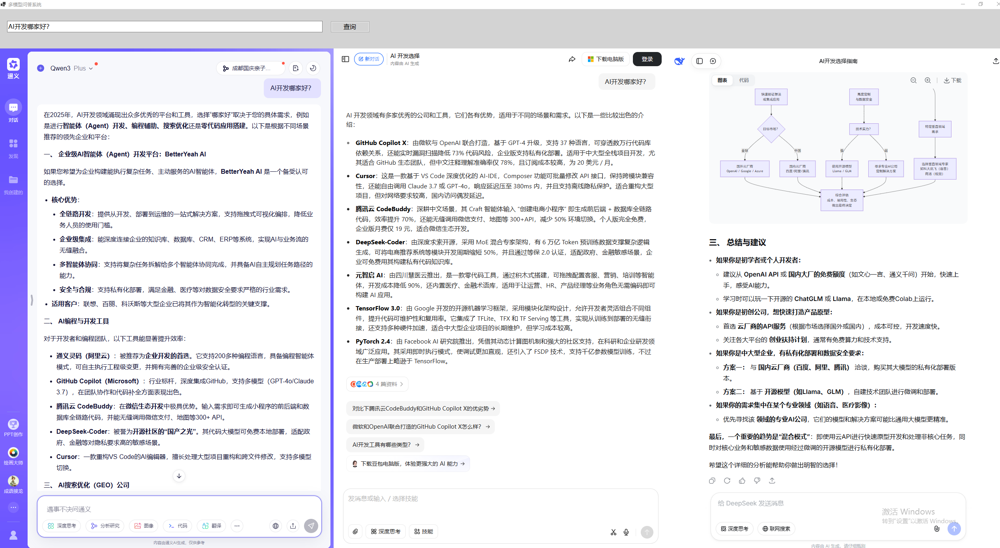

# Multi-Model Q&A System in a Single Window

This is a C# and WebView2-based implementation that opens multiple large model systems in a single window. You can input your query in the window and simultaneously send the same question to Tongyi Qianwen, Doubao, and DeepSeek, and view the responses from each model.

Before use, users need to log in to each website individually. After logging in, the same input can be received and responded to by all models.

Please Give an Star if you like it.

## Final Effect




## Description
  When I use large models to search for information, I often need to ask the same question across multiple large models and identify the differences and similarities in their responses to determine if there are hallucinations or incorrect outputs.
  In reality, I need to repeatedly copy a question and operate in various browsers, which is a bit troublesome, so I wrote this tool.
  On my display with a resolution of 2560x1440, I can fully see the output content from different large model vendors.
###  All software code is generated by AI. I only wrote the prompts. The tool I used is Qorder, version as follows:
  Version: 0.2.5
   VSCode Version: 1.100.0 (user setup)
   Commit: 16cd366960161a956c5ec5d028a1a295e2b0529c
   Date: 2025-10-10T12:08:54.752Z
   Electron: 34.5.1
   Chromium: 132.0.6834.210
   Node.js: 20.19.0
   V8: 13.2.152.41-electron.0
   OS: Windows_NT x64 10.0.19045

## Latest Release

Current version: **V1.1** ([Release Notes](releases/RELEASE_NOTES_V1.1.md))

### Download Links
- [MultiModelChat_V1.1.zip](https://github.com/wadereye/MultiModelChatInOneWindow/ReleasesFile/download/V1.1/MultiModelChat_V1.1.zip) - Complete executable package

*Note: Release files can be downloaded from the GitHub Release page. Local releases directory files are not included in version control.*

## Features

1. Full-screen window interface
2. Top section includes search input box and query button
3. Bottom section is divided into three columns, displaying Tongyi Qianwen, Doubao, and DeepSeek web pages
4. After clicking the query button, the question is automatically injected into the input boxes of all three websites
5. Supports window size adjustment and rearrangement
6. Added expand/collapse functionality to view a specific model's interface in full screen
7. Added clear button for easy input text clearing

## System Requirements

- Windows 10 or higher
- .NET 6.0 SDK
- Microsoft Edge WebView2 Runtime (usually installed automatically with Windows updates)

## Installation and Running

1. Ensure .NET 6.0 SDK is installed
2. Open the project using Visual Studio or command line
3. Restore NuGet packages:
   ```
   dotnet restore
   ```
4. Build the project:
   ```
   dotnet build
   ```
5. Run the project:
   ```
   dotnet run
   ```

## Usage

1. After starting the application, the window will automatically display in full screen
2. Enter your query question in the top input box
3. Click the "Query" button or press Enter
4. The program will automatically:
   - Switch to each model window
   - Click the input box area through JavaScript to ensure focus
   - Copy the question to the clipboard
   - Simulate Ctrl+V paste operation
   - Simulate Enter key to send the question
5. Each model will automatically receive and process the question

## Technical Implementation

- Create user interface using C# WinForms
- Embed web pages using Microsoft WebView2 controls
- Locate and click input boxes through JavaScript injection technology
- Simulate keyboard operations (paste and enter) using SendKeys class
- Support responsive layout adjustment

## Keyboard Simulation Technology Details

To solve the problem of input box focus loss, the program adopts a more reliable keyboard simulation method:

1. **Window Focus Switching**: First switch to the target WebView window
2. **JavaScript Click**: Click the input box area through JavaScript code to ensure focus
3. **Clipboard Operations**: Copy the question text to the system clipboard
4. **Keyboard Simulation**: Use SendKeys.SendWait method to simulate Ctrl+V paste operation
5. **Auto Send**: Simulate Enter key to automatically send the question

This approach is more reliable than direct JavaScript injection because it simulates real user operation processes.

## Notes

- On first run, WebView2 may need to download runtime components
- Due to the security policies of various websites, the injection effect may change with website updates
- Do not manually operate the keyboard while the program is running to avoid interfering with the automation process
- Some antivirus software may block keyboard simulation operations, please add the program to the trusted list